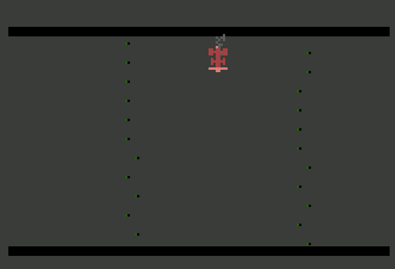

Racer, RetroZock 2020
----------------------
Mein Beitrag zum Basic- 10- liner Wettbewerb 2020.
Kategorie: Pur- 120.

Alle Wettbewerbsbeiträge: (Offizielle Seite): https://gkanold.wixsite.com/homeputerium)

Getestet mit Atari800MacX v5.0.1 und auf der original Hardware, einem Atari800XL.

Disk- Image mit eingeschaltetem Basic booten. Das Spiel starten: RUN "D:RACER2.BAS"

Steuerung
---------
Im Emulator unter den Einstellungen den USB- Joytick als "Joystick 2" anmelden.
Am originalen Atari 800XL/ XE den Joystick an Port 2 anschließen.

Ablauf
------
Die Rennbahn scrollt von unten nach oben, halten Sie ihre Rennwagen auf der Straße. 
Wenn die Straßenbegrenzug berührt wird, dann ist das Spiel aus. Versuchen Sie
die weiteste Strecke zurückzulegen. Ihr Ergebniss wird ihnen nach jedem Rennen
auf dem Startbildschirm angezeigt. Mein Rekort liegt bei 774 Meilen.

Viel Spass!

Zu einfach? Den code anpassen...
--------------------------------
Zeile 33:
Dort wird die Breite der Rennstrecke im Spielverlauf verkleinert. Der Ausdruck
B=B-((B>8))*0.05 bestimmt die minimale Bereite der Strecke.Der Faktor 0.05 legt den
Änderungsfaktor fest, der bestimmt, wie schnell die minimale Breite erreicht wird.
Die Variable B wird in Zeile 0 auf ihren Startwert festgelegt.

Technical info for my future self.......
----------------------------------------
x=x+(Stick(1)=7)
Schlägt zwei Fliegen mit einer Klappe. Stickabfrage und gleichzeitige 
Änderung der Spieler Koordinaten.

x=((Q>0))
Wenn die Aussage in der Klammer wahr ist, dann entspricht das dem Zahlenwert 1.
Wenn nicht, dann 0.... 

Data- Zeilen
Man kann dem DATA- Befehl beliebig BASIC- Befehle voranstellen.
Umgekehrt geht es nicht! Also:

9 RESTORE 10

10 Print "Hallo": POKE 34,255:data 3,4,5,3

Funktioniert.

Kontakt
-------
Berthold Fritz, berthold.fritz@hotmail.com

